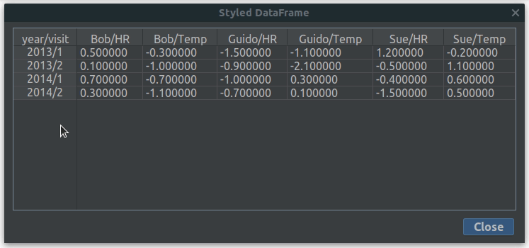

# Version 0.4.0

July, 2021

### Notable Changes

* initial support for pandas 1.3
* revised table header for multi-index `DataFrames`
* reduced size of generated html
* beta status hint removed
* plugin logo added
* compatibility with IntelliJ 2021.2
* upgrade dependency `jsoup` to 1.14.1

#### Bug fixes
* wrong calculated multi-index label in table header

### Supported pandas Versions
* 1.1.x
* 1.2.x
* 1.3.x (new in this version)

### Min Required IntelliJ Version
* 2020.3

## What's New

#### Initial Support For pandas 1.3
All already by the plugin supported `Styler` methods are now also usable with pandas 1.3. Some of them got additional parameters, which are also supported.
- `Styler.apply`
- `Styler.applymap`
- `Styler.background_gradient`
- `Styler.format`
- `Styler.highlight_max`
- `Styler.highlight_min`
- `Styler.highlight_null`
- `Styler.set_properties`

And the following methods, added in pandas 1.3, are also on board:
- `Styler.highlight_between`
- `Styler.highlight_quantile`
- `Styler.text_gradient`

#### Revised Table Header For Multi-Index DataFrames
Revised table header parsing and rendering to improve handling of multi-index `DataFrames`.

Index names of multi-index `DataFrames` are now included in the header tooltip. Before it was not possible to see this information.

Code of the multi-index `DataFrame` example:

### Reduced Size Of Generated HTML
The size of the html file generated in Python has been reduced. Unused content is now excluded, which can reduce the size of the generated html file. The reduction depends on the used styling.

### Beta Status Hint Removed
In the last two versions of the plugin, a lot of the code was rewritten to provide better testing capabilities. Almost all tests previously performed manually are now automated.